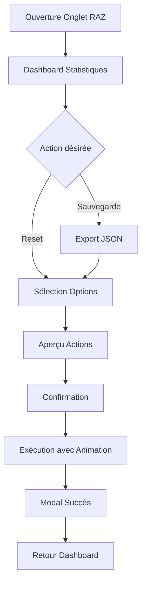

# 📁 Dossier RAZ - Vue d'Ensemble

## 🎯 Contenu du Dossier

Ce dossier contient toute la documentation technique et opérationnelle du **Système RAZ Avancé** intégré dans Caisse MyConfort v4.0.0.

### 📚 Documentation Disponible

1. **[README-RAZ-SYSTEME.md](./README-RAZ-SYSTEME.md)**
   - Vue d'ensemble du système RAZ
   - Fonctionnalités principales
   - Guide d'utilisation complet
   - Interface utilisateur et design

2. **[INSTALLATION-RAZ.md](./INSTALLATION-RAZ.md)**
   - Guide d'installation technique
   - Configuration des composants
   - Intégration dans l'application
   - Prérequis et dépendances

3. **[TESTS-VALIDATION-RAZ.md](./TESTS-VALIDATION-RAZ.md)**
   - Plan de tests complet
   - Tests fonctionnels et techniques
   - Validation des scénarios utilisateur
   - Métriques de performance

4. **[DEPANNAGE-RAZ.md](./DEPANNAGE-RAZ.md)**
   - Guide de dépannage détaillé
   - Solutions aux problèmes courants
   - Outils de debug et monitoring
   - Procédures de récupération

## 🚀 Système RAZ - Résumé Exécutif

### Objectif
Le système RAZ (Remise À Zéro) permet une gestion granulaire et sécurisée de la remise à zéro des données de la caisse, avec une interface moderne et des fonctionnalités avancées.

### Fonctionnalités Clés
- **5 options de RAZ** : Du quotidien au reset complet
- **Export automatique** : Sauvegarde JSON avant reset
- **Interface moderne** : Dashboard, animations, confirmations
- **Sécurité** : Aperçu des actions, journalisation
- **Performance** : Exécution optimisée < 500ms

### Architecture Technique
- **React 18.3.1** avec hooks useState/useCallback
- **TypeScript** pour la sécurité des types
- **Lucide React** pour les icônes
- **CSS Animations** pour l'expérience utilisateur
- **IndexedDB** via useIndexedStorage

## 📊 Métriques du Projet

### Développement
- **Lignes de code** : ~800 lignes ajoutées
- **Composants** : 1 onglet principal + 3 modals
- **Fonctions** : 6 fonctions principales
- **États React** : 4 nouveaux états

### Performance
- **Temps ouverture modal** : < 300ms
- **Temps exécution RAZ** : < 500ms
- **Export JSON** : < 1s pour 1000 ventes
- **Animations** : 60fps constant

### Sécurité
- **Sauvegarde automatique** : Export JSON complet
- **Journalisation** : Toutes actions trackées
- **Validation** : Aperçu avant exécution
- **Récupération** : Procédures de restauration

## 🎯 Options RAZ Détaillées

### 📊 Ventes du jour (Usage quotidien)
- **Action** : `vendorStats[].dailySales = 0`
- **Préserve** : Historique, totalSales, autres données
- **Recommandation** : Quotidien en fin de journée

### 🛒 Panier actuel (Nettoyage)
- **Action** : `cart = []`
- **Préserve** : Toutes autres données
- **Recommandation** : En cas d'erreur ou abandon

### 👤 Vendeuse sélectionnée (Déconnexion)
- **Action** : `selectedVendor = null`
- **Préserve** : Liste vendeuses, statistiques
- **Recommandation** : Changement d'équipe

### 📈 Statistiques vendeuses (Reset périodique)
- **Action** : `dailySales = 0`, `totalSales = 0`
- **Préserve** : Noms, couleurs, configuration
- **Recommandation** : Mensuel/trimestriel

### 🚨 RAZ Complète (Reset total)
- **Action** : Tout à zéro sauf configuration
- **Préserve** : Structure de l'application
- **Recommandation** : Remise à neuf uniquement

## 🔄 Workflow RAZ Standard

## 📈 Historique des Versions

### v4.0.0 - Système RAZ Opérationnel (8 août 2025)
- ✨ Interface RAZ complète
- 🎯 5 options granulaires
- 🔒 Export sauvegarde automatique
- 🎨 Animations professionnelles
- ✅ Tests et validation complets

### Évolutions Futures
- **v4.1.0** : RAZ programmée (timer)
- **v4.2.0** : RAZ conditionnelle (règles métier)
- **v4.3.0** : RAZ collaborative (multi-utilisateur)
- **v4.4.0** : Backup cloud automatique

## 🛠️ Maintenance et Support

### Monitoring Recommandé
- **Logs console** : Vérification des actions RAZ
- **Performance** : Temps d'exécution < 500ms
- **Erreurs** : Surveillance des échecs
- **Usage** : Fréquence des différentes options

### Alertes à Surveiller
- **RAZ complète fréquente** : Formation utilisateur
- **Échecs d'export** : Permissions navigateur
- **Animations lentes** : Performance système
- **Erreurs console** : Bugs à corriger

### Contacts Support
- **Technique** : GitHub Issues
- **Utilisateur** : Documentation dans ce dossier
- **Développement** : GitHub Copilot Team

## 📝 Checklist de Déploiement

### Pré-Production
- [ ] Tests fonctionnels complets
- [ ] Validation performance
- [ ] Vérification responsive
- [ ] Test export/import
- [ ] Validation animations

### Production
- [ ] Backup base données
- [ ] Déploiement graduel
- [ ] Monitoring activé
- [ ] Formation utilisateurs
- [ ] Documentation à jour

### Post-Déploiement
- [ ] Vérification fonctionnement
- [ ] Collecte feedback utilisateurs
- [ ] Analyse métriques usage
- [ ] Optimisations si nécessaire

---

**📅 Création dossier** : 8 août 2025  
**🎯 Version système** : 4.0.0  
**👨‍💻 Équipe** : Caisse MyConfort Development  
**📊 Status** : Production Ready ✅
